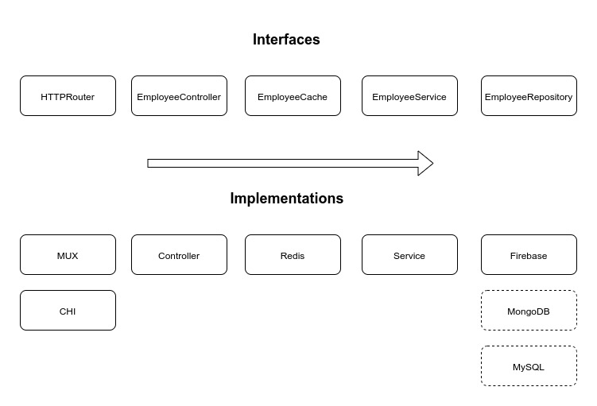
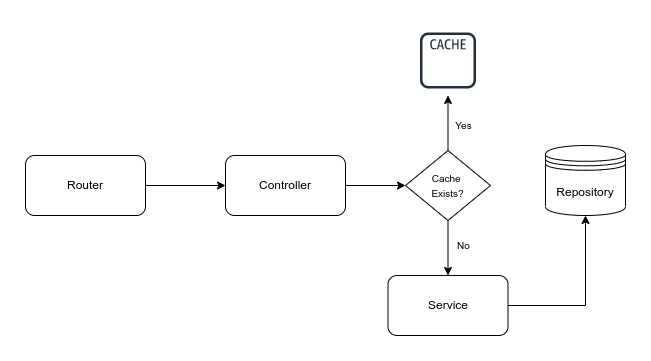

### Personnel API
An Implementation of Clean Architecture principles in REST API server using Go. 

**Benefits of Clean Architecture:**
- Independent of frameworks.
- Testable.
- Independent of UI.
- Independent of database.

#### Overview:


#### Control Flow:


### API Reference

##### Get all employees

```http
GET /employees
```

##### Get an employee

```http
GET /employees/${id}
```

##### Add an employee

```http
POST /employees
```

### Run Locally
Install and start Redis server for caching.
```bash
sudo apt install redis-server
sudo systemctl status redis-server
```
Clone the project.

```bash
git clone https://github.com/hmsayem/clean-architecture-implementation.git
```
Go to the project directory.

```bash
cd clean-architecture-implementation
```

Copy all third-party dependencies to vendor folder.

```bash
go mod vendor
```

Export environment variables.

```bash
GOOGLE_APPLICATION_CREDENTIALS=/path/to/project-private-key.json

SERVER_PORT=:8000

REDIS_SERVER_HOST=localhost:6379
```

Start the server.

```bash
go run .
```

### Run with Docker
#### Run Redis Server
```bash
docker run --name redis --net=host -d redis
```
#### Run API server
Build image.

```bash
docker build -t employee-server .
```
Run container.

```bash
docker run --mount type=bind,source=/path/to/project-private-key.json,target=/run/secrets/project-private-key.json,readonly --env GOOGLE_APPLICATION_CREDENTIALS='/run/secrets/project-private-key.json' --env SERVER_PORT=':8000' --env REDIS_SERVER_HOST='localhost:6379' --net host employee-server
```

### Deploy on Kubernetes
Create secret from `project-private-key.json`
```bash
kubectl create secret generic firestore-secret --from-file=/path/to/project-private-key.json
```
Create Configmaps
```bash
kubectl apply -f k8s/redis-server-cm.yaml
kubectl apply -f k8s/employee-server-cm.yaml
```
Create Pods
```bash
kubectl apply -f k8s/redis-server.yaml
kubectl apply -f k8s/employee-server.yaml
```
Create Services
```bash
kubectl apply -f k8s/redis-server-svc.yaml
kubectl apply -f k8s/employee-server-svc.yaml
```
Port Forward
```bash
kubectl port-forward svc/employee 8000
```

### Examples of API Requests
##### Get all employees
```bash
❯ curl -X GET  "http://localhost:8000/employees" | jq
[
  {
    "id": 50,
    "name": "Kamol Hasan",
    "title": "Senior Software Engineer",
    "team": "B",
    "email": "kamol@gmail.com"
  },
  {
    "id": 81,
    "name": "Piyush Kanti Das",
    "title": "Software Engineer",
    "team": "A",
    "email": "piyush@gmail.com"
  }
]
```
##### Get an employee
```bash
❯ curl -X GET  "http://localhost:8000/employees/81" | jq
{
  "id": 81,
  "name": "Piyush Kanti Das",
  "title": "Software Engineer",
  "team": "A",
  "email": "piyush@gmail.com"
}
```


##### Update an employee
```bash
 ❯ curl -X PUT "http://localhost:8000/employees/81" -d '{"title": "Senior Software Engineer"}'
```

##### Add an employee
```bash
 ❯ curl -X POST "http://localhost:8000/employees" -d '{"name": "Hossain Mahmud","title": "Software Engineer","team": "A","email": "hossain@gmail.com"}'

{"id":89,"name":"Hossain Mahmud","title":"Software Engineer","team":"A","email":"hossain@gmail.com"}

```
### Run Unit Tests
##### Test Service Layer using Mock Repository
```bash
go test service/employee-service.go  service/employee-service_test.go
```
### Acknowledgements
 - [Pragmatic Reviews](https://www.youtube.com/c/PragmaticReviews)